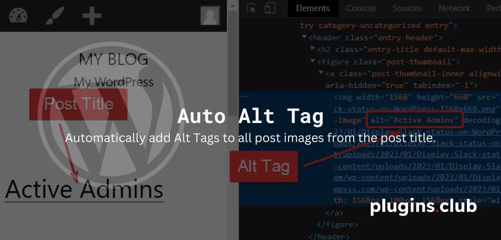
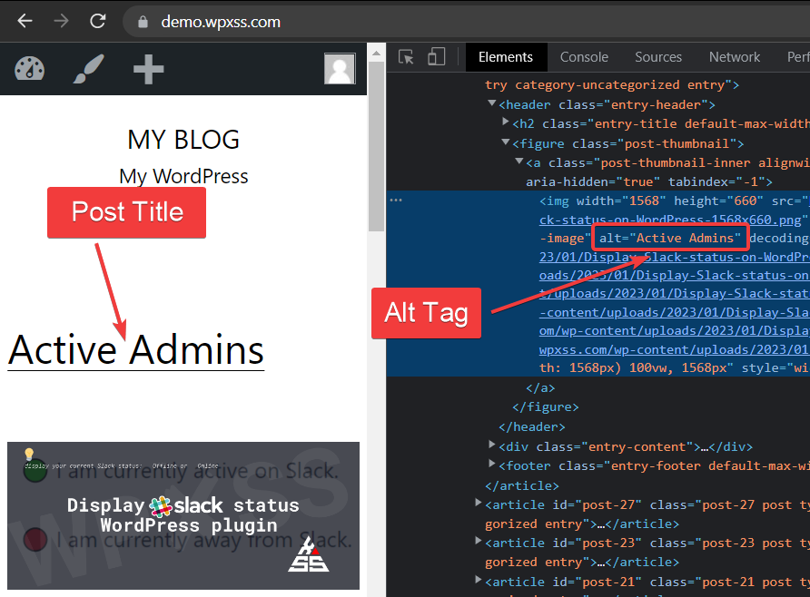

# Auto Alt Tag WordPress plugin

Auto Alt Tag is a WordPress SEO plugin that automatically updates all images with proper ALT attributes for SEO purposes. If your post images do not have **ALT** tag already set, the plugin will add them automatically.

**ALT** attribute is an important part of search engine optimization. It describes your images to search engines and when a user searches for a certain image this is a key determining factor for a match. Search engines like Google use this information to understand the context of an image; to find out what an image shows, and what its purpose is.

**ALT** attributes are also required to get [a W3C/xHTML-valid website](https://validator.w3.org/).

Simply install & activate the plugin and it will automatically add Alt Tag to images in new posts.

